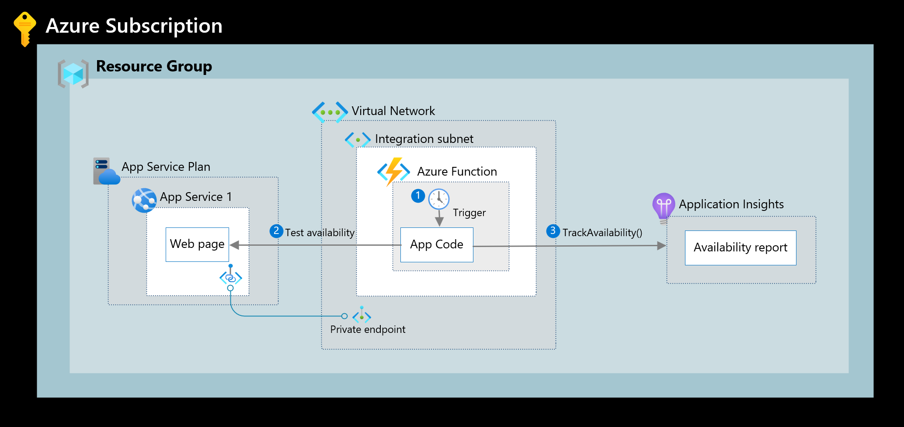

# app-insights-private-availability-testing

## Overview

Demo function app illustrating how to perform availability tests within a private network

The following image illustrates the high-level architecture.

An **Azure App Service** is connected to a Virtual Network using private link. A **Function App** is injected into the Virtual Network and has line of sight to the App Service. The Function App is configured to perform availability tests against the App Service and reports status to **Application Insights** using the `TrackAvailability()` method.

  
## Prerequisites
The following resources provisioned:
- Virtual Network with subnet for private endpoints and VNet injection 
- App Service with private link enabled
- Function App with VNet injection
- Application Insights

## Considerations
- Use Microsoft Entra ID authentication for Application Insights
- Use Azure Monitor Private Link Scope for Application Insights

## Resources
- [Private Availability Testing](https://learn.microsoft.com/en-us/azure/azure-monitor/app/availability-private-test)
- [Review TrackAvailability() test results](https://learn.microsoft.com/en-us/azure/azure-monitor/app/availability-azure-functions)
- [Microsoft Entra authentication for Application Insights](https://learn.microsoft.com/en-us/azure/azure-monitor/app/azure-ad-authentication?tabs=net)
- [Use Azure Private Link to connect networks to Azure Monitor](https://learn.microsoft.com/en-us/azure/azure-monitor/logs/private-link-security)